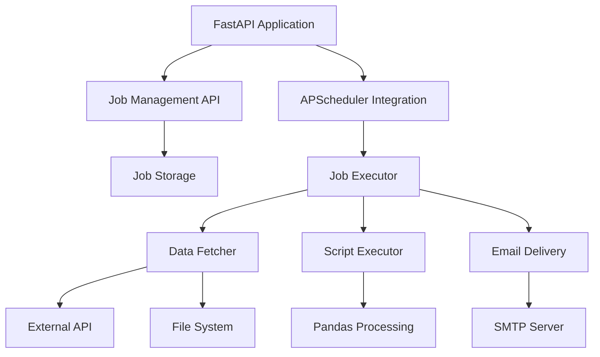

# Design Document

## Overview

The Scheduled Jobs Service is a FastAPI application that manages recurring data processing jobs. The system integrates APScheduler for job scheduling, Pandas for data manipulation, and SMTP for email delivery. The architecture follows a modular design with clear separation between API endpoints, job management, execution logic, and delivery mechanisms.

## Architecture



### Component Layers

1. **API Layer**: FastAPI endpoints for job CRUD operations
2. **Scheduling Layer**: APScheduler integration for job timing
3. **Execution Layer**: Job executor orchestrating data fetch, processing, and delivery
4. **Storage Layer**: JSON-based persistence for job configurations
5. **Delivery Layer**: SMTP-based email service

## Components and Interfaces

### 1. FastAPI Application (main.py)

**Responsibilities:**
- Initialize FastAPI app
- Configure CORS and middleware
- Manage application lifecycle (startup/shutdown)
- Initialize APScheduler on startup
- Load persisted jobs on startup

**Key Functions:**
```python
@app.on_event("startup")
async def startup_event()

@app.on_event("shutdown")
async def shutdown_event()
```

### 2. Job Models (models/job.py)

**JobCreate (Pydantic Model):**
```python
class DataSource(BaseModel):
    source_type: Literal["api", "file"]
    location: str  # URL or file path
    file_type: Optional[Literal["csv", "json"]]  # Required for file type

class JobCreate(BaseModel):
    job_name: str
    schedule_time: str  # Cron expression
    data_source: DataSource
    processing_script: str
    consumer_emails: List[EmailStr]
    
    @validator('schedule_time')
    def validate_cron(cls, v):
        # Validate cron expression format
        
    @validator('job_name')
    def validate_unique_name(cls, v):
        # Check uniqueness against storage
```

**JobConfig (Storage Model):**
```python
class JobConfig(BaseModel):
    job_name: str
    schedule_time: str
    data_source: DataSource
    processing_script: str
    consumer_emails: List[str]
    created_at: datetime
    last_run: Optional[datetime]
```

### 3. Job API Endpoints (api/jobs.py)

**POST /jobs/create**
- Accept JobCreate model
- Validate parameters
- Persist job configuration
- Register with APScheduler
- Return job details with 201 status

**GET /jobs**
- List all registered jobs
- Return array of JobConfig

**GET /jobs/{job_name}**
- Retrieve specific job details
- Return 404 if not found

**DELETE /jobs/{job_name}**
- Remove job from APScheduler
- Delete persisted configuration
- Return 204 on success

### 4. Job Storage (storage/job_storage.py)

**Responsibilities:**
- Persist job configurations to JSON file
- Load job configurations on startup
- Provide CRUD operations for job configs

**Key Functions:**
```python
def save_job(job_config: JobConfig) -> None
def load_all_jobs() -> List[JobConfig]
def get_job(job_name: str) -> Optional[JobConfig]
def delete_job(job_name: str) -> bool
def job_exists(job_name: str) -> bool
```

**Storage Format:**
- File: `data/jobs.json`
- Structure: Array of JobConfig objects serialized as JSON

### 5. Scheduler Manager (scheduler/scheduler_manager.py)

**Responsibilities:**
- Initialize APScheduler with BackgroundScheduler
- Register jobs with cron triggers
- Remove jobs from scheduler
- Manage scheduler lifecycle

**Key Functions:**
```python
def init_scheduler() -> BackgroundScheduler
def add_job(job_config: JobConfig, executor_func: Callable) -> None
def remove_job(job_name: str) -> None
def start_scheduler() -> None
def shutdown_scheduler() -> None
```

**Configuration:**
- Use BackgroundScheduler (non-blocking)
- CronTrigger for schedule parsing
- Job store: in-memory (jobs loaded from JSON on startup)

### 6. Job Executor (executor/job_executor.py)

**Responsibilities:**
- Orchestrate job execution flow
- Handle errors and send notifications
- Log execution details

**Main Function:**
```python
async def execute_job(job_config: JobConfig) -> None:
    try:
        # 1. Fetch data
        df = await fetch_data(job_config.data_source)
        
        # 2. Execute processing script
        result_df = execute_script(job_config.processing_script, df)
        
        # 3. Convert to CSV
        csv_content = result_df.to_csv(index=False)
        
        # 4. Send email
        await send_email(
            job_config.job_name,
            job_config.consumer_emails,
            csv_content
        )
        
        # 5. Update last_run timestamp
        update_last_run(job_config.job_name)
        
    except Exception as e:
        # Send failure notification
        await send_failure_email(job_config, str(e))
```

### 7. Data Fetcher (executor/data_fetcher.py)

**Responsibilities:**
- Fetch data from external APIs
- Read data from internal files
- Convert to Pandas DataFrame

**Key Functions:**
```python
async def fetch_data(data_source: DataSource) -> pd.DataFrame:
    if data_source.source_type == "api":
        return await fetch_from_api(data_source.location)
    else:
        return fetch_from_file(data_source.location, data_source.file_type)

async def fetch_from_api(url: str) -> pd.DataFrame:
    # Use httpx for async HTTP requests
    # Parse JSON response to DataFrame

def fetch_from_file(path: str, file_type: str) -> pd.DataFrame:
    # Use pd.read_csv() or pd.read_json()
```

### 8. Script Executor (executor/script_executor.py)

**Responsibilities:**
- Execute user-provided Python scripts safely
- Pass input DataFrame
- Capture output DataFrame
- Enforce timeout limits

**Key Function:**
```python
def execute_script(script_content: str, input_df: pd.DataFrame) -> pd.DataFrame:
    # Create restricted execution environment
    # Inject input_df as 'data' variable
    # Execute script with timeout (300 seconds)
    # Extract and validate output DataFrame
    # Return result
```

**Security Considerations:**
- Use `exec()` with restricted globals/locals
- Whitelist allowed imports (pandas, numpy, datetime)
- Implement timeout using signal.alarm or threading
- Validate output is a DataFrame

### 9. Email Delivery (delivery/email_service.py)

**Responsibilities:**
- Send success emails with CSV attachments
- Send failure notification emails
- Configure SMTP connection

**Key Functions:**
```python
async def send_email(
    job_name: str,
    recipients: List[str],
    csv_content: str
) -> None:
    # Create email with attachment
    # Subject: "Job Results: {job_name} - {timestamp}"
    # Attach CSV file
    # Send via SMTP

async def send_failure_email(
    job_config: JobConfig,
    error_message: str
) -> None:
    # Notify consumers of job failure
```

**Configuration (Environment Variables):**
- `SMTP_HOST`: SMTP server hostname
- `SMTP_PORT`: SMTP server port (default: 587)
- `SMTP_USER`: SMTP username
- `SMTP_PASSWORD`: SMTP password
- `SMTP_FROM_EMAIL`: Sender email address
- `SMTP_USE_TLS`: Enable TLS (default: true)

## Data Models

### Job Configuration Schema

```json
{
  "job_name": "daily_sales_report",
  "schedule_time": "0 9 * * 1-5",
  "data_source": {
    "source_type": "api",
    "location": "https://api.example.com/sales",
    "file_type": null
  },
  "processing_script": "result = data.groupby('category').sum()",
  "consumer_emails": ["analyst@example.com"],
  "created_at": "2025-11-09T10:00:00Z",
  "last_run": "2025-11-09T09:00:00Z"
}
```

### Cron Expression Format

Standard 5-field cron format:
```
* * * * *
│ │ │ │ │
│ │ │ │ └─── Day of week (0-6, Sunday=0)
│ │ │ └───── Month (1-12)
│ │ └─────── Day of month (1-31)
│ └───────── Hour (0-23)
└─────────── Minute (0-59)
```

Examples:
- `0 9 * * 1-5`: 9 AM, Monday-Friday
- `30 14 * * *`: 2:30 PM daily
- `0 */6 * * *`: Every 6 hours

## Error Handling

### Error Categories

1. **Validation Errors** (HTTP 400)
   - Invalid cron expression
   - Duplicate job name
   - Invalid email format
   - Missing required fields

2. **Data Fetch Errors**
   - API request timeout (30 seconds)
   - HTTP error responses (4xx, 5xx)
   - File not found
   - Invalid file format

3. **Script Execution Errors**
   - Syntax errors in processing script
   - Runtime exceptions
   - Timeout (300 seconds)
   - Invalid output (not a DataFrame)

4. **Email Delivery Errors**
   - SMTP connection failure
   - Authentication failure
   - Invalid recipient addresses

### Error Handling Strategy

**For API Requests:**
- Return appropriate HTTP status codes
- Include detailed error messages in response body
- Log errors with stack traces

**For Job Execution:**
- Log all errors with job context
- Send failure notification emails to consumers
- Continue scheduler operation (don't crash)
- Store error details in job execution history

**Retry Logic:**
- Data fetch: 3 retries with exponential backoff
- Email delivery: 2 retries with 5-second delay
- Script execution: No retries (fail fast)

## Testing Strategy

### Unit Tests

1. **Model Validation Tests**
   - Test cron expression validation
   - Test email format validation
   - Test data source validation

2. **Data Fetcher Tests**
   - Mock API responses
   - Test CSV/JSON file parsing
   - Test error handling

3. **Script Executor Tests**
   - Test successful execution
   - Test timeout enforcement
   - Test error capture
   - Test output validation

4. **Email Service Tests**
   - Mock SMTP server
   - Test attachment creation
   - Test failure notifications

### Integration Tests

1. **End-to-End Job Flow**
   - Create job via API
   - Trigger immediate execution
   - Verify email delivery
   - Verify job persistence

2. **Scheduler Integration**
   - Test job registration
   - Test job removal
   - Test startup job loading

3. **API Endpoint Tests**
   - Test all CRUD operations
   - Test error responses
   - Test validation

### Manual Testing

1. **Schedule Verification**
   - Create jobs with various cron expressions
   - Verify execution at correct times

2. **Email Delivery**
   - Test with real SMTP server
   - Verify CSV attachment format
   - Test multiple recipients

## Configuration Management

### Environment Variables

Required:
- `SMTP_HOST`
- `SMTP_PORT`
- `SMTP_USER`
- `SMTP_PASSWORD`
- `SMTP_FROM_EMAIL`

Optional:
- `SMTP_USE_TLS` (default: true)
- `JOB_STORAGE_PATH` (default: ./data/jobs.json)
- `LOG_LEVEL` (default: INFO)
- `SCRIPT_TIMEOUT` (default: 300)
- `API_FETCH_TIMEOUT` (default: 30)

### Configuration File

Use `.env` file for local development:
```
SMTP_HOST=smtp.gmail.com
SMTP_PORT=587
SMTP_USER=your-email@gmail.com
SMTP_PASSWORD=your-app-password
SMTP_FROM_EMAIL=your-email@gmail.com
```

## Deployment Considerations

### Dependencies

Core:
- fastapi
- uvicorn[standard]
- pydantic[email]
- apscheduler
- pandas
- httpx
- python-multipart

### Directory Structure

```
scheduled-jobs-service/
├── app/
│   ├── main.py
│   ├── models/
│   │   └── job.py
│   ├── api/
│   │   └── jobs.py
│   ├── storage/
│   │   └── job_storage.py
│   ├── scheduler/
│   │   └── scheduler_manager.py
│   ├── executor/
│   │   ├── job_executor.py
│   │   ├── data_fetcher.py
│   │   └── script_executor.py
│   └── delivery/
│       └── email_service.py
├── data/
│   └── jobs.json
├── tests/
├── .env
├── requirements.txt
└── README.md
```

### Running the Service

```bash
# Install dependencies
pip install -r requirements.txt

# Set environment variables
cp .env.example .env
# Edit .env with your SMTP credentials

# Run the service
uvicorn app.main:app --host 0.0.0.0 --port 8000 --reload
```

### Production Considerations

- Use process manager (systemd, supervisor)
- Configure proper logging (file rotation)
- Set up monitoring for job execution
- Implement job execution history/audit log
- Consider using persistent job store for APScheduler
- Add authentication/authorization for API endpoints
- Rate limiting for job creation
- Resource limits for script execution (memory, CPU)
